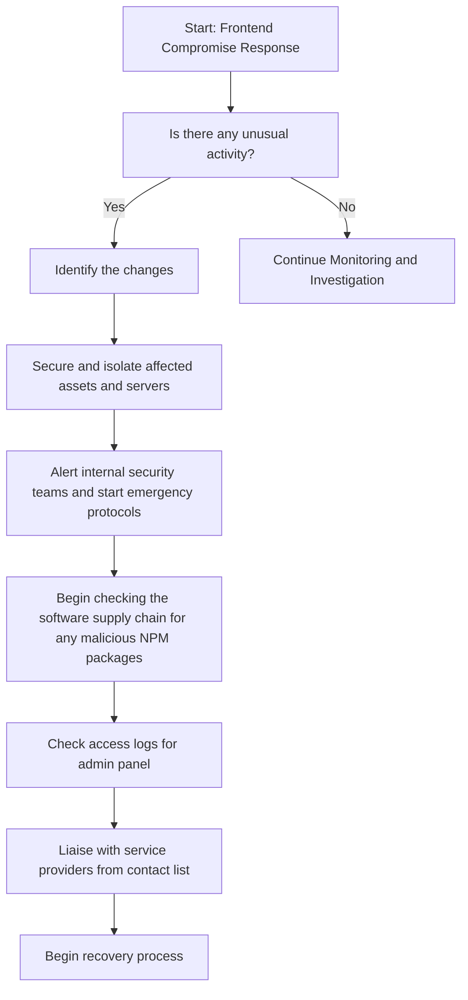

```mermaid
flowchart TD
    A[Start: Frontend Compromise Response] --> B[Is there any unusual activity?]
    B -- Yes --> C[Identify the changes]
    C --> D[Secure and isolate affected assets and servers]
    B -- No --> E[Continue Monitoring and Investigation]
    D --> F[Alert internal security teams and start emergency protocols]
    F --> G[Begin checking the software supply chain for any malicious NPM packages]
    G --> H[Check access logs for admin panel]
    H --> I[Liaise with service providers from contact list]
    I --> J[Begin recovery process]
```