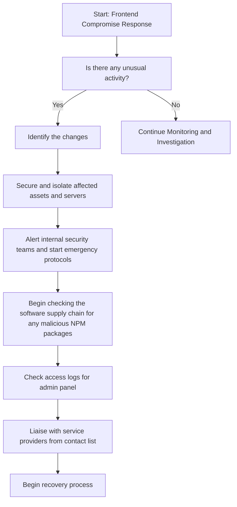

# Frontend Compromise Response Guide

### Table of Contents
- [Scope](#scope)
- [1. Preparation](#1-preparation)
- [2. Identification](#2-identification)
- [3. Response](#3-response)
- [4. Recovery](#4-recovery)

## Scope

This playbook is specifically designed to address response to a compromised frontend.

## 1. Preparation

Toggle for Details

- **Audit and Review**: Regularly audit frontend code and dependencies for vulnerabilities.
- **Monitoring Measures**: Setup inhouse monitoring to help identification of any unusual activities.
- **Incident Response Team**: Establish an incident response team to engage in a war room scenario.
- **Regularly stocktake node packages**: Maintain regular audits and stocktake of NPM packages. 
- **Maintain access list**: Maintain and regularly audit a list of who has access to admin panel.
- **Regular Backups**: Maintain a staging environment and backups for emergency use.
- **Pre-written Comms**: Engage legal team to draft pre-written comms to use in case of emergency.
- **Maintain contact list**: Maintain a contact list with service providers and white-hats.

## 2. Identification

Toggle for Details

- Identify the incident from monitoring capability:
    - Inhouse monitoring signals.
- Publicly Identified compromise:
    - Members of the public have identified and alerted to the compromise. 
    - A public security service has identified the compromise.
- Identify the changes that resulted from the frontend compromise:
    - Check the DNS change logs of the webpage.
    - Filter through unusual frontend interactions.
    - Identify any new contract addresses on the frontend.

## 3. Response

Toggle for Details

- Immediate steps following frontend compromise detection:
    - Secure and isolate affected assets and servers.
    - Alert internal security teams and start emergency protocols.
    - Issue organization-wide notifications to cease all frontend-related operations temporarily.
    - Begin checking the software supply chain for any malicious NPM packages.
    - Check access logs for admin panel.
- Liaise with service providers from contact list for:
    - Assistance in tracking and halting malicious activities.
    - Support in recovering compromised assets, if possible.
    - Advice on fortifying security measures post-incident.
    - Report any phishing contract address to [chain abuse](chainabuse.com)
    - If webpage is actively visited and user funds drained, report URL to [Metamask Phishing detect](https://github.com/MetaMask/eth-phishing-detect/blob/main/src/blacklist.js).
- Begin distributing pre-written communications:
    - Where possible have legal pre-read and authorize distribution.
    - Use social profiles to distribute initial statement.

## 4. Recovery

Toggle for Details

- Analyze the incident to determine:
    - The vulnerability that lead to the exploit.
    - The full extent of damages, including asset loss and data compromise (if any).
    - Necessary improvements in security protocols and staff training for prevention.
- Begin backup deployment and returning webpage to normal operation:
    - Only after access audit and package audit.
    - Only after vulnerability identified and mitigated.
    - Reconfigure DNS settings and review.
    - Remove any reports to MM Phshing Detect (if applicable).
- Develop a recovery strategy encompassing:
    - Steps for safe resumption of all operations.
    - Stocktake of new and old server addresses following incident.
    - Preventative measures against future incidents (bug bounties etc).
    - Communication plans to restore trust with affected parties.

