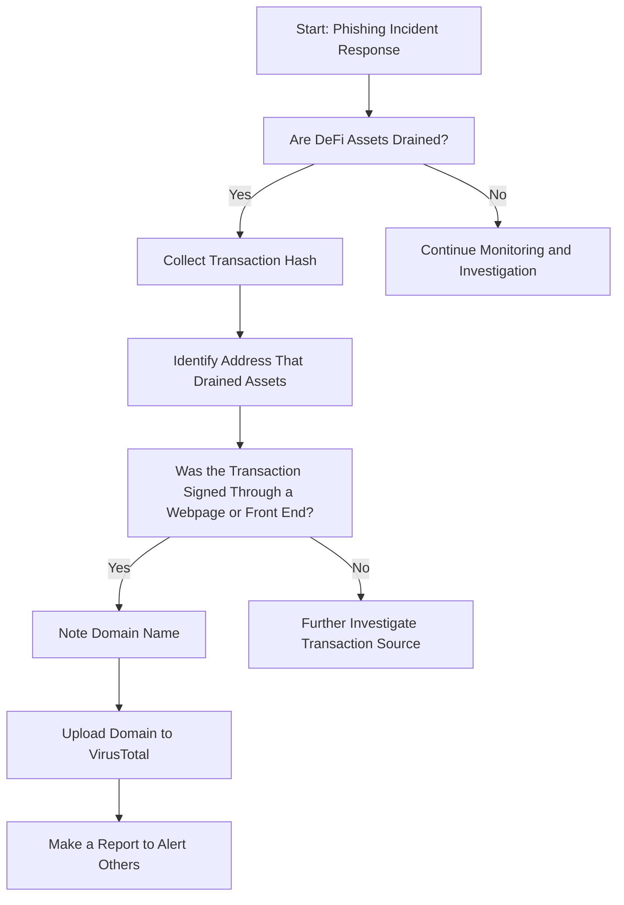

# DeFi Phishing Response Guide

### Table of Contents
- [Scope](#scope)
- [1. Preparation](#1-preparation)
- [2. Identification](#2-identification)
- [3. Response](#3-response)
- [4. Recovery](#4-recovery)

## Scope

This playbook is specifically designed to address response to a phishing link being clicked.

## 1. Preparation

Toggle for Details

- Compile a detailed inventory of 
    - all blockchain assets and domains controlled by the organization.
        - Crucial for avoiding errors with internal digital resources.
    - personnel authorized to manage blockchain transactions and smart contracts.
- Formulate communication templates 
    - to quickly alert employees of ongoing phishing attacks targeting the company.
    - for collaboration with hosting and blockchain service providers against malicious entities.
    - to inform external stakeholders about potential security threats.
- Create a new hot-wallet
    - write down seed phrase
    - quickly send any remaining funds from compromized wallet/s

## 2. Identification

Toggle for Details

- Identify the transaction hash that resulted from the phishing incident:
    - Filter though unusual smart contract interactions.
    - Requests from unknown wallet addresses.
    - Unexpected transaction signing requests.
- Identify the front end and domain that incited the phishing incident:
    - Using recent browser history.
    - Inspect recent emails that may have transported the link.
    - Triage domains though Virus Total.

## 3. Response

Toggle for Details

- Immediate steps upon a phishing attack detection:
    - Secure and isolate affected assets and wallets.
    - Alert internal security teams and start emergency protocols.
    - Issue organization-wide notifications to cease all blockchain-related operations temporarily.
    - Pause any active contracts (if possible).
    - Begin sending any remaining assets to new hot-wallet
- Liaise with blockchain networks or service providers for:
    - Assistance in tracking and halting malicious activities.
    - Support in recovering compromised assets, if possible.
    - Advice on fortifying security measures post-incident.
- Report the phishing link, contract and or wallet address:
    - Upload URL to virus total.
    - Create a pull request to [MM phishing detect](https://github.com/MetaMask/eth-phishing-detect/commits/main/src/config.json) and add the URL.

## 4. Recovery

Toggle for Details

- Analyze the incident to determine:
    - The point of entry and methods used in the phishing attack.
    - The full extent of damages, including asset loss and data compromise (if any).
    - Necessary improvements in security protocols and staff training for prevention.
- Develop a recovery strategy encompassing:
    - Steps for safe resumption of all operations.
    - Stocktake of new and old wallets following incident.
    - Preventative measures against future incidents.
    - Communication plans to restore trust with affected parties.

