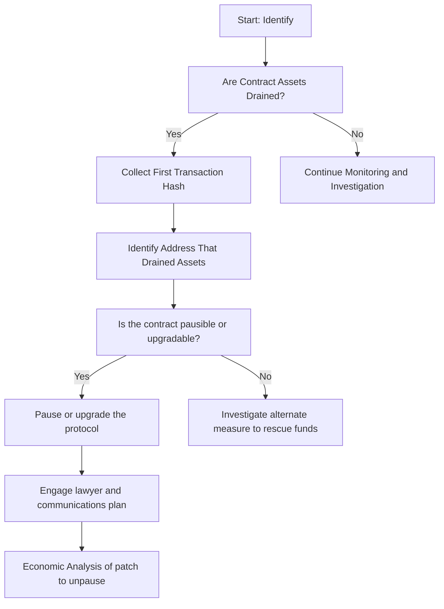

```mermaid
flowchart TD
    A[Start: Identify] --> B[Are Contract Assets Drained?]
    B -- Yes --> C[Collect First Transaction Hash]
    C --> D[Identify Address That Drained Assets]
    B -- No --> E[Continue Monitoring and Investigation]
    D --> F[Is the contract pausible or upgradable?]
    F -- Yes --> G[Pause or upgrade the protocol]
    G --> H[Engage lawyer and communications plan]
    H --> I[Economic Analysis of patch to unpause]
    F -- No --> J[Investigate alternate measure to rescue funds]
```