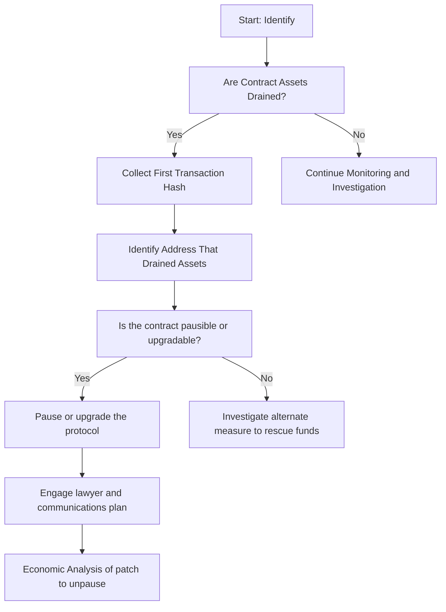

# Smart Contract Attack Response Guide

### Table of Contents
- [Scope](#scope)
- [1. Preparation](#1-preparation)
- [2. Identification](#2-identification)
- [3. Response](#3-response)
- [4. Recovery](#4-recovery)

## Scope

This playbook is specifically designed to address response to a broad range of smart contract attacks.

## 1. Preparation

Toggle for Details

- **Audit and Review**: Regularly audit smart contracts for vulnerabilities.
- **Monitoring Measures**: Setup inhouse monitoring to help identification. 
- **Incident Response Team**: Establish an incident response team to engage in a war room scenario.
- **Pre-written Comms**: Engage legal team to draft pre-written comms to use in case of emergency.
- **Circuit Breakers**: Implement circuit breakers into smart contracts that can pause or prevent further loss. 
- **Maintain contact list**: Maintain a contact list with service providers and white-hats.

## 2. Identification

Toggle for Details

- Identify the transaction hash that resulted from the smart contract attack:
    - Filter though unusual smart contract interactions.
    - Large transfer of assets.
- Identify the incident from monitoring capability:
    - Inhouse monitoring signals.
- Publicly Identified attack:
    - Members of the public have identified and alerted to the attack. 
    - A public security service has identified the attack.

## 3. Response

Toggle for Details

- Immediate steps following smart contract attack detection:
    - Secure and isolate affected assets and wallets.
    - Alert internal security teams and start emergency protocols.
    - Issue organization-wide notifications to cease all blockchain-related operations temporarily.
    - Pause any active contracts (if possible).
    - Begin sending any remaining assets to new hot-wallet or contract.
- Liaise with service providers from contact list for:
    - Assistance in tracking and halting malicious activities.
    - Support in recovering compromised assets, if possible.
    - Advice on fortifying security measures post-incident.
- Begin distributing pre-written communications:
    - Where possible have legal pre-read and authorize distribution.
    - Use social profiles to distribute initial statement.
- Begin engaging development team for patch if possible:
    - What are the economic impacts of a patch?
    - What are the knock on effects to other contracts?

## 4. Recovery

Toggle for Details

- Analyze the incident to determine:
    - The vulnerability that lead to the exploit.
    - The full extent of damages, including asset loss and data compromise (if any).
    - Necessary improvements in security protocols and staff training for prevention.
- Develop a recovery strategy encompassing:
    - Steps for safe resumption of all operations.
    - Stocktake of new and old contract addresses following incident.
    - Preventative measures against future incidents (bug bounties etc).
    - Communication plans to restore trust with affected parties.

