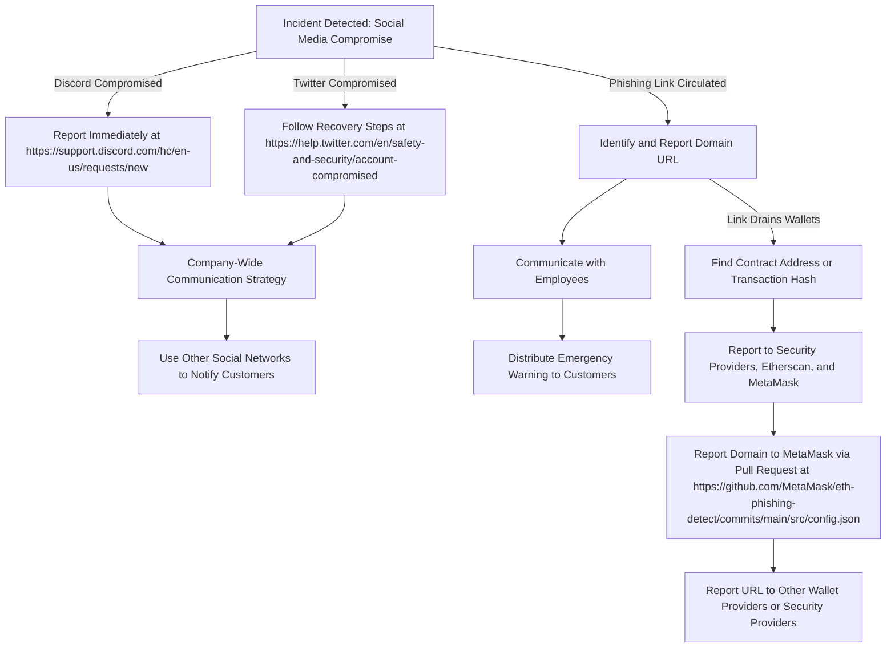

```mermaid
flowchart TD
    A[Incident Detected: Social Media Compromise] -->|Discord Compromised| B[Report Immediately at https://support.discord.com/hc/en-us/requests/new]
    A -->|Twitter Compromised| C[Follow Recovery Steps at https://help.twitter.com/en/safety-and-security/account-compromised]
    B --> D[Company-Wide Communication Strategy]
    C --> D
    D --> E[Use Other Social Networks to Notify Customers]
    A -->|Phishing Link Circulated| F[Identify and Report Domain URL]
    F --> G[Communicate with Employees]
    G --> H[Distribute Emergency Warning to Customers]
    F -->|Link Drains Wallets| I[Find Contract Address or Transaction Hash]
    I --> J[Report to Security Providers, Etherscan, and MetaMask]
    J --> K[Report Domain to MetaMask via Pull Request at https://github.com/MetaMask/eth-phishing-detect/commits/main/src/config.json]
    K --> L[Report URL to Other Wallet Providers or Security Providers]
```