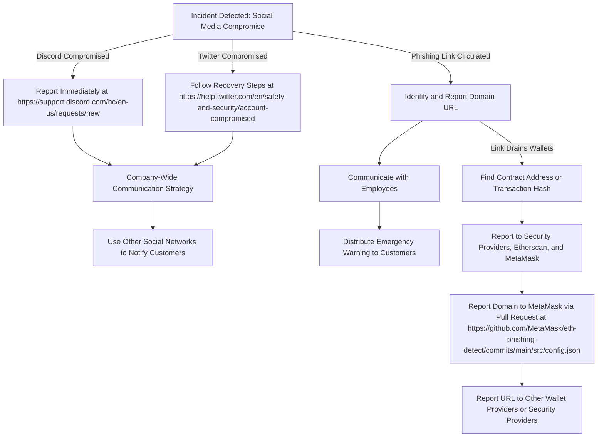

# Social Compromised Credentials Incident Response Playbook

## Table of Contents
- [1. Preparation](#1-preparation)
- [2. Identification](#2-identification)
- [3. Response](#3-response)
- [4. Recovery](#4-recovery)
- [5. Lessons Learned](#5-lessons-learned)

## 1. Preparation

- Identify the Incident Response Team and outline their duties.
- Define escalation paths for incidents that may escalate in severity or impact.
- Monitor for signs of compromised credentials across social media platforms. (This may include implementing logging levels).
- Set up alerts for unusual activity on official social media accounts.
- Create a lockdown strategy for discord.
- Create a reporting avenue for community members.

## 2. Identification

- Use the evidence that resulted in notification of compromise to determine next steps based on method of compromise. (Some steps may be irrelevant based on the method of compromise.)
    1. Examples of evidence: An email from an external client reporting reception of a phishing email or malware, unusual login patterns or locations, activities executed by a user account that cannot be explained by the user, etc.
    2. Method of compromise instances: Phishing attempts aimed at harvesting credentials, scraping credentials from local systems, password guessing through brute force, etc.
- Determine initial method of account compromize.
    1. Interview to gather points of compromize: eg. Did you recieve a suspicious email?
    2. Search for phishing emails (phishing emails are the most common method of credntial theft).
    3. Once method of initial compromise is determined, use the Indicators of Compromise (IoCs) gathered to search the environment for other victims.

## 3. Response

- If Twitter account compromized Follow [Recovery Steps](https://help.twitter.com/en/safety-and-security/account-compromised)
    1. Begin company wide communication strategy to alert of compromized platform. 
    2. Begin communicating to customers to avoid clicking any links in twitter communications. 
    3. If a link has been posted, report immediately to Virus Total and PR [MetaMask Phishing Detect](https://github.com/MetaMask/eth-phishing-detect).
    4. If link requires wallet connection which may result in drainage, report the associated contract address to [Etherscan](https://info.etherscan.com/report-address/#:~:text=Search%20for%20the%20address%20of,Address%20from%20the%20dropdown%20menu.) and [Chain Abuse](https://www.chainabuse.com/report).

- If Discord server compromized immediately [Report it](https://support.discord.com/hc/en-us/requests/new)
    1. If access to server is still available, begin locking down server.
    2. Begin revoking roles in server.
    3. Communicate via Twitter that discord server is compromized, click no links.
    4. If a link has been posted, report immediately to Virus Total and PR [MetaMask Phishing Detect](https://github.com/MetaMask/eth-phishing-detect).
    5. If link requires wallet connection which may result in drainage, report the associated contract address to [Etherscan](https://info.etherscan.com/report-address/#:~:text=Search%20for%20the%20address%20of,Address%20from%20the%20dropdown%20menu.) and [Chain Abuse](https://www.chainabuse.com/report).

## 4. Recovery

- Secure and regain control of compromised accounts.
- Conduct a thorough investigation to understand the breach's extent.
- Restore normal operations with enhanced security measures.

## 5. Lessons Learned

- Review the incident to identify any gaps in security protocols.
- Update response strategies based on the incident's insights.
- Train staff on updated security practices and awareness.

