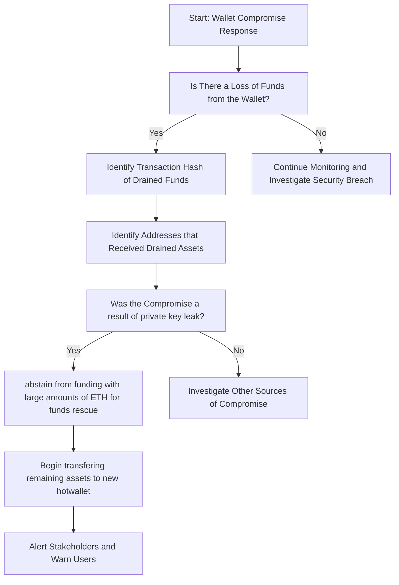

```mermaid
flowchart TD
    A[Start: Wallet Compromise Response] --> B[Is There a Loss of Funds from the Wallet?]
    B -- Yes --> C[Identify Transaction Hash of Drained Funds]
    C --> D[Identify Addresses that Received Drained Assets]
    B -- No --> E[Continue Monitoring and Investigate Security Breach]
    D --> F[Was the Compromise a result of private key leak?]
    F -- Yes --> G[abstain from funding with large amounts of ETH for funds rescue]
    G --> H[Begin transfering remaining assets to new hotwallet]
    H --> I[Alert Stakeholders and Warn Users]
    F -- No --> J[Investigate Other Sources of Compromise]
```