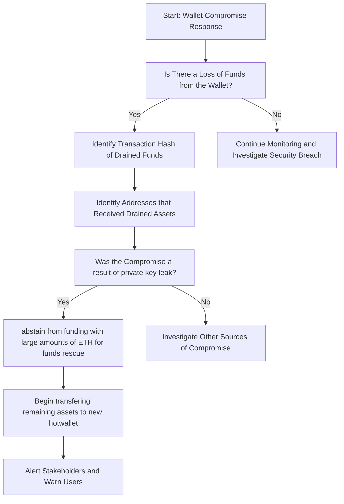

# DeFi Wallet Compromize Incident Response Playbook

### Table of Contents
- [Scope](#scope)
- [1. Preparation](#1-preparation)
- [2. Identification](#2-identification)
- [3. Response](#3-response)
- [4. Recovery](#4-recovery)

## Scope

This playbook is specifically designed to address response to a DeFi wallet compromize resulting in loss of funds.

## 1. Preparation

Toggle for Details

- Compile a detailed inventory of 
    - all blockchain assets and domains controlled by the organization.
        - Crucial for avoiding errors with internal digital resources.
    - personnel authorized to manage blockchain transactions and smart contracts.
- Formulate communication templates 
    - to inform external stakeholders about potential security threats.
- Create a new hot-wallet
    - write down seed phrase
    - quickly send any remaining funds from compromized wallet/s
- Implement wallet monitoring
    - monitor transactions and state changes accross wallets.
- Create an access list of employees who have access to seed phrases and private keys.

## 2. Identification

Toggle for Details

- Monitoring alerts to loss of funds from wallet:
    
- Identify the transaction hash that resulted from the compormized wallet:
    - first transaction that drained funds.
    - receipt addresses.
    
- Identify the means which resulted in private key or seed phrase leak.
    - refer to [Stealer Malware](#) & [Phishing](../Phising/playbook.md)
    - private key hygiene
    - begin interviewing employees on access list

## 3. Response

Toggle for Details

- Immediate steps upon wallet drainage:
    - Avoid sending large amounts of ETH (or gas asset) to primary wallet.
    - Transfer any and all remaining funds and assets to the new hotwallet.
    - Alert internal security teams and start emergency protocols.
    - Issue organization-wide notifications to cease all blockchain-related operations temporarily.
    - Update any active contracts with new admin (if applicable).
- Liaise with blockchain networks or service providers for:
    - Assistance in tracking and halting malicious activities.
    - Support in recovering compromised assets, if possible.
    - Advice on fortifying security measures post-incident.

## 4. Recovery

Toggle for Details

- Analyze the incident to determine:
    - The failures in security controls pertaining to wallet (key phrase, private keys).
    - The full extent of damages, funds audit.
    - Necessary improvements in security protocols and staff training for prevention.
- Develop a recovery strategy encompassing:
    - Steps for safe resumption of all operations.
    - Stocktake of new and old wallets following incident.
    - Preventative measures against future incidents.
    - Communication plans to restore trust with affected parties.

